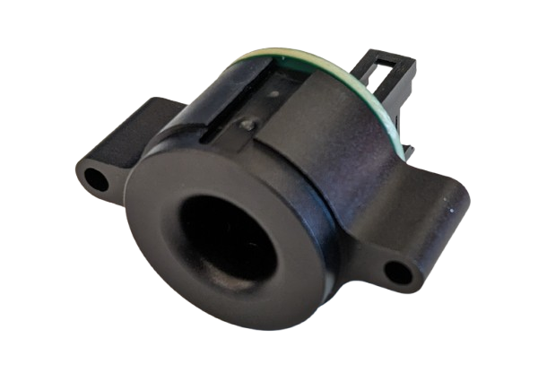
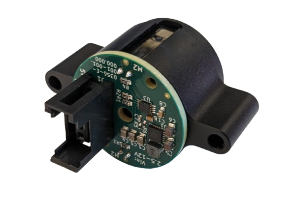

# harp.peripheral.delphi-poke

companion circuit board for Mouse "Poke" Port.

  
&nbsp; &nbsp; &nbsp; &nbsp;
  

> [!NOTE]
> This repository is for the electronics hardware only. For the physical Poke Port, see the [CAD Model](https://cad.onshape.com/documents/066d94ed47eba590ef197816/w/7206c419a0e3b3641e025c3e/e/6c7b2bb3fef528a1d7258398) (Onshape).

## Fabrication

For installing the Poke Port into a mouse home cage, we recommend drilling out a 25mm hole with a hole saw ([example](https://www.mcmaster.com/products/hole-saws/diameter~25-mm/)), and installing M3 heat-set inserts into the home cage for threaded mounting.
